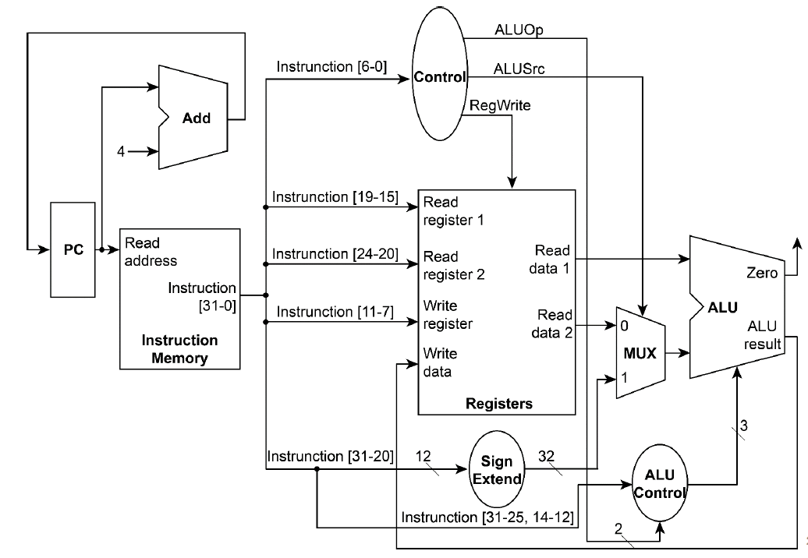

# Verilog implementation of a simple RISC-V single-cycle CPU

## Datapath

## Supported Instrctions

- and rd, rs1, rs2 (bitwise and)

- xor rd, rs1, rs2 (bitwise exclusive or)

- sll rd, rs1, rs2 (shift left logically)

- add rd, rs1, rs2 (addition)

- sub rd, rs1, rs2 (subtraction)

- mul rd, rs1, rs2 (multiplication)

- addi rd, rs1, imm (addition)

- srai rd, rs1, imm (shift right arithmetically)

Instructions should be convert into machine code for CPU input
